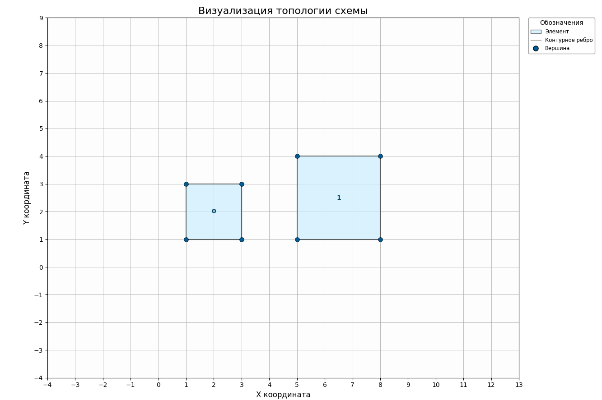

# ITD-01

### Лабораторная №1: Создание интегральной схемы в JSON, работа с GDS форматом.

### Цель работы: 
Изучение формата описания топологии интегральной схемы в JSON и получение практических навыков конвертации данных в формат GDS.

### Задача:

  1. Создать свой JSON-файл топологии ИС в соответствии с описанной структурой и требованиями ниже.
  2. Используя библиотеку gdstk на Python конвертировать полученный .json формат в .gds.
  3. Загрузить получившийся .gds файл в **[Online GDS Viewer](https://www.appliednt.com/gds-viewer/)**, сделать скриншот результата.
  4. Сформировать отчёт.

### Требования к JSON-файлу
| Параметр                          | Значение          | 
| --------------------------------- | ----------------- | 
| Количество элементов              | >15               | 
| Нарушения DRC                     | ≥2                | 
| Минимальный допустимый зазор      | 2.0               | 

### Структура JSON-файла.

Входной JSON-файл имеет строго регламентированную структуру и предназначен для описания геометрических данных макета. Корневым элементом файла является поле cells.
Поле cells представляет собой массив объектов, каждый из которых описывает логическую ячейку (cell) макета. Ячейка объединяет набор геометрических фигур и соответствует отдельному уровню или компоненту проектируемой структуры.

Для каждого объекта в массиве cells обязательны следующие атрибуты: 
1) name - строковый идентификатор ячейки (например, имя слоя или логического блока).
2) shapes - массив объектов, описывающих геометрические фигуры, принадлежащие данной ячейке.

### 
```json
"cells": [
  {
    "name": "Figure",
    "shapes": [ ... ]
  }
]
```

Поле shapes представляет собой массив объектов, каждый из которых описывает одну геометрическую фигуру в рамках ячейки.

Для каждой фигуры обязательны следующие атрибуты:
1) type - строковый идентификатор типа фигуры.
   В текущей версии поддерживается значение:
   polygon - многоугольник, заданный упорядоченным списком вершин.
2) layer - целочисленный идентификатор слоя, на котором расположена фигура.
3) datatype - целочисленный идентификатор типа данных слоя (устанавливаем значение 0).
4) points - массив пар координат, описывающих вершины фигуры.

Поле points задаёт геометрию фигуры и представляет собой массив массивов из двух целых чисел:
1) Первое значение - координата X вершины.
2) Второе значение - координата Y вершины.

### 
```json
{
  "type": "polygon",
  "layer": 1,
  "datatype": 0,
  "points": [
    [1, 1],
    [3, 1],
    [3, 3],
    [1, 3]
  ]
}
```


### Пример выполненной работы c файлом dataset_01.json:



### Состав отчёта.

1. 

